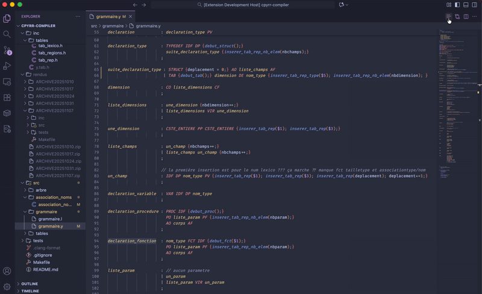

# Yacc Actions Folder

A simple VS Code extension that folds all semantic actions in Yacc files to make them easier to read and navigate.

## Features

- **Automatic folding**: Automatically detects and folds semantic actions in `.y` and `.yacc` files
- **Zero configuration**: Works out of the box, no settings required
- **Lightweight**: No dependencies, minimal performance impact


<!-- Add a demo GIF/screenshot if you have one -->

## Installation

### From VSIX (Recommended)

1. Download the latest `.vsix` file from the [Releases](https://github.com/ahddi/yacc-actions-folder/releases) page
2. Open VS Code
3. Go to Extensions (`Ctrl+Shift+X` / `Cmd+Shift+X`)
4. Click the `...` menu at the top
5. Select "Install from VSIX..."
6. Choose the downloaded `.vsix` file

### From Source

```bash
git clone https://github.com/ahddi/yacc-actions-folder.git
cd yacc-actions-folder
npm install
npm run compile
code --install-extension .
```

## Usage

Simply open any Yacc file and click the list-shaped button on top-right of your editor to fold, re-click to unfold.

## Supported File Types

- `.y`
- `.yacc`

## Requirements

- VS Code version 1.80.0 or higher

## Contributing

Contributions are welcome! Feel free to open an issue or submit a pull request.

## License

GPL

## Release Notes

### 1.0.0

- Initial release
- Basic semantic action folding for Yacc files

---

**Enjoy cleaner Yacc files!** ✨